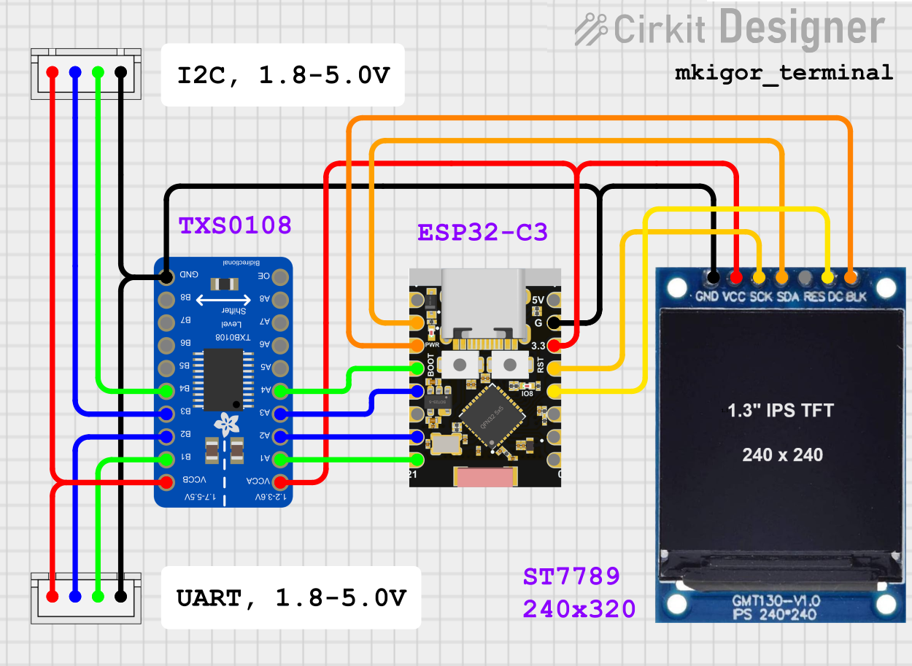

# mkigor_terminal_p
Debug display termanal. 
Serial, UART (Serial0), I2C (addr 0x39) => display terminal (st7789 240x320 px, 20x20 symbols) 
Terminal accept sybols with code from 0x20 to 0x7F. Buffer has 1000 sybbols, after lost by FIFO. 
Symbols 0x0D, 0x0D + 0x0A are interpreter like new line. 

 
